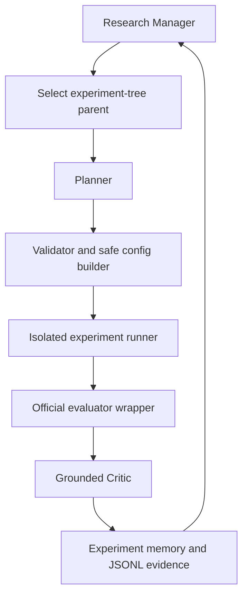

# Planner/Critic Research Architecture

This document describes the **legacy** root `agent/` + `experiment/` prototype.
It is exercised by `python run_agent.py --dry-run` or `--real-run`. The
authoritative loop is `src/techjam_agent/`, launched with
`python3 scripts/run_agent.py`.

The prototype was set up so orchestration, safety, memory, and evidence formats
could be tested independently of the live researcher.



## Component boundaries

- `agent/manager.py` owns the loop, budgets, convergence, duplicate prevention,
  and final best-node designation.
- `agent/planner.py` defines the structured Planner input/output contract. In this
  prototype the deterministic planner is an architecture fixture.
- `agent/critic.py` separates measured observations from interpretations,
  confidence, decisions, and follow-up tests.
- `agent/tree.py` keeps the best node from up to three research branches and
  scores candidates using exploitation, exploration, novelty, and runtime cost.
- `agent/memory.py` stores parent/child lineage, configurations, results, lessons,
  visit counts, and the best-node marker.
- `experiment/runner.py` is the experiment boundary. The dry-run backend returns
  clearly labelled simulated metrics; `--real-run` trains the official FM
  backend on validation only.
- `experiment/validator.py` restricts operations, models, features, parameter
  ranges, non-finite values, and protected organizer files before execution.
- `experiment/evaluator.py` loads the organizer evaluator read-only and can pin
  its SHA-256 digest.
- `experiment/logger.py` appends the required hypothesis, diff, metrics,
  critique, cost, and failure evidence as JSONL.
- `recommender/` defines immutable configuration transformations, feature/model
  registries, and the future `train_model()` boundary.

## Tree policy

The system uses a lightweight best-first tree, not full MCTS:

```text
priority = primary score
         + exploration bonus
         + branch novelty bonus
         - runtime penalty
```

Only the strongest node from each of the top three branches remains on the active
frontier. This preserves alternative hypotheses while staying practical within
the 50-iteration and six-hour competition limits.

## Safety invariants

1. The Planner returns an `ExperimentSpec`; it does not directly execute code.
2. Safe operations create a new immutable `ModelConfig` from a parent config.
3. Duplicate candidate configurations are rejected before execution.
4. The official evaluator and baseline metadata are protected paths.
5. Failed or worse experiments remain evidence but cannot erase the best node.
6. The Critic receives validation metrics only and must distinguish observation
   from interpretation.
7. Novel patch mode and work delegation are disabled in `configs/agent.json`.

## Current versus deferred

Currently runnable **in this prototype**: schemas, tree selection, deterministic
Planner, safe config operations, validation, dry-run Runner, isolated official-FM
validation backend, grounded Critic, memory, JSONL logging, budgets, convergence,
and tests. The real backend discards post-validation rows before reading
`long_view` and stores each checkpoint/prediction in its experiment directory.

The live competition agent (`src/techjam_agent/` via `scripts/run_agent.py`) already
includes allow-listed LLM proposals, persistent evidence, and the isolated NumPy
training backends. Do not treat the deferred list below as the status of that stack.

Deferred in this prototype: repair generation and novel code patches.
