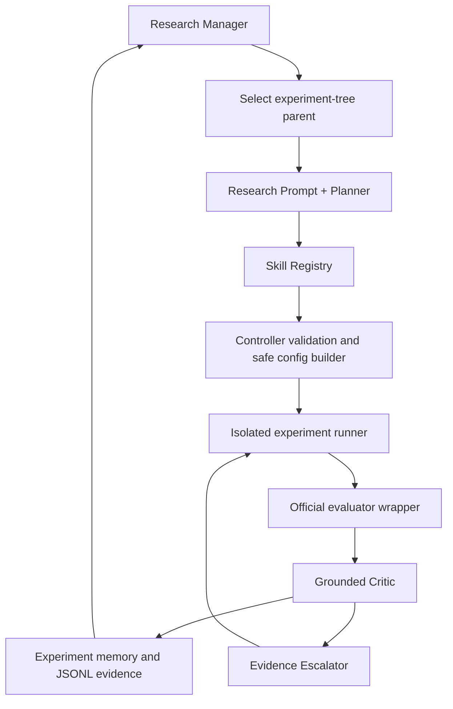

# Planner/Critic Research Architecture

This is the active control architecture for the autonomous ML researcher. The
deterministic and LLM selectors share the same executable skills, safety rules,
memory, and evidence formats.



## Prompt, Skills, and Controller

```text
Prompt     = how the researcher reasons (soft policy)
Skills     = what the current system can execute (registered capabilities)
Controller = what must never be violated (hard policy)
```

`src/techjam_agent/research_prompt.py` contains research principles, not model
answers. `src/techjam_agent/skills.py` registers ten reusable discovery,
training, evidence, and memory capabilities. Ranked candidates carry a primary
`skill_id`, risk, and required confirmation skills. The Controller resolves that
binding again before execution and rejects missing or mismatched capabilities.

The LLM cannot register a skill or edit code. An unavailable graph/model builder
is reported as a capability gap. A future Capability Builder must pass a bounded
schema, runner, and smoke-test contract before registration.

## Component boundaries

- `src/techjam_agent/controller.py` owns the loop, budgets, convergence, duplicate prevention,
  and final best-node designation.
- `src/techjam_agent/experiment_planner.py` generates and ranks executable candidates;
  `proposals.py` provides deterministic and OpenAI-compatible selectors.
- `src/techjam_agent/critic.py` separates measured observations from interpretations,
  confidence, decisions, and follow-up tests.
- `src/techjam_agent/tree.py` keeps the best node from up to three research branches and
  scores candidates using exploitation, exploration, novelty, and runtime cost.
- `src/techjam_agent/memory.py` stores configurations, results, lessons,
  visit counts, and the best-node marker.
- `src/techjam_agent/config.py` restricts models, features, parameter ranges, and
  legal immutable configuration changes.
- `src/techjam_agent/isolated.py` and `runner.py` train real models in subprocesses,
  persist validation predictions, and use the hash-pinned organizer evaluator.
- `src/techjam_agent/evidence_escalator.py` turns promising discoveries into
  rolling and paired-seed confirmation jobs.

## Tree policy

The system uses a lightweight best-first tree, not full MCTS:

```text
priority = primary score
         + exploration bonus
         + branch novelty bonus
         - runtime penalty
```

Only the strongest node from each of the top three branches remains on the active
frontier. This preserves alternative hypotheses while staying practical within
the 50-iteration and six-hour competition limits.

## Safety invariants

1. The Planner returns an `ExperimentSpec`; it does not directly execute code.
2. Safe operations create a new immutable `ModelConfig` from a parent config.
3. Duplicate candidate configurations are rejected before execution.
4. The official evaluator and baseline metadata are protected paths.
5. Failed or worse experiments remain evidence but cannot erase the best node.
6. The Critic receives validation metrics only and must distinguish observation
   from interpretation.
7. Novel patch mode and work delegation are disabled in `configs/agent.json`.

## Current versus deferred

Currently runnable: deterministic and LLM selection, FM/DeepFM/multi-task/DCNv2/
sequence/LightGBM/ensemble training, safe config operations, isolated evaluation,
placebo controls, rolling and paired-seed confirmation, diagnostics, structured
memory, JSONL logging, budgets, dual convergence, and intervention accounting.

Deferred: a restricted Capability Builder, graph-model skill, and learned or
search-based higher-level planning. Arbitrary LLM code patches remain disabled.
