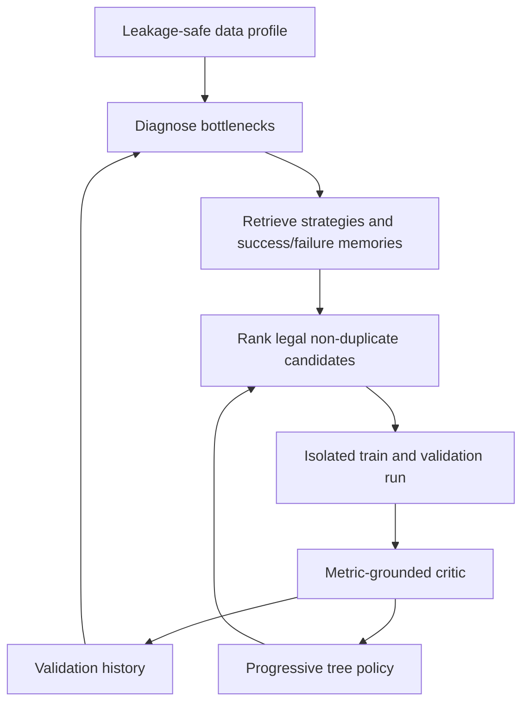

# Progressive ML research architecture

The project has one runnable autonomous research stack: `scripts/run_agent.py`
orchestrates the modules in `src/techjam_agent/`. It adapts the useful parts of AIDE
and MLEvolve to a fixed offline recommender benchmark. The Planner can select a
pre-registered operator or propose a new, statically validated code branch; the
Controller remains the authority for execution, validation, promotion, and rollback.



## Research loop

1. Reuse the exact durable validation checkpoint as iteration 0 when available.
2. Diagnose runtime failures, metric trade-offs, model saturation, weak feature
   increments, and provisional gains from validation-only history.
3. Retrieve at most two genuine global-incumbent improvements and three relevant
   failures plus the matching strategy cards.
4. Enumerate only compatible, non-duplicate configurations from the operator registry.
5. Rank a five-candidate shortlist using diagnostic fit, novelty, prior outcome,
   measured delta, runtime, and the current explore/focus/confirm phase.
6. Expand a primary branch, an intra-branch refinement, a cross-branch reference, or
   a late aggregation/confirmation candidate depending on stagnation and budget.
7. Execute the selected configuration in an isolated worker and evaluate it with the
   unchanged official validation metrics.
8. Store reward, outcome, critique, primary lineage, reference edges, and reusable
   success/failure lessons before the next iteration.

The LLM and deterministic researchers receive the same ranked candidate and evidence
contract. In autonomous mode the Controller additionally composes bounded, compatible
feature/optimizer bundles at runtime; this lets the Planner discover interactions that
were not pre-written as recipes. The LLM selects and explains; the Controller owns validation, execution,
budget enforcement, duplicate prevention, KEEP/REJECT decisions, and the test firewall.

## Progressive allocation

Exploration probability decays from `0.90` to `0.20`. Early iterations favor novel
branches; middle iterations favor empirically promising strategies; late iterations
favor elite parents, replication, and validated ensembles. Candidates with timeout
history receive a strong penalty, and the selected candidate must fit the remaining
budget using its historical runtime estimate and a safety factor.

Search outcomes use a global-incumbent reward signal:

- execution failure: `-1`
- valid but non-improving, including branch-local improvement: `0`
- global validation improvement larger than epsilon: `2`

The baseline root also receives zero reward. Only the baseline and epsilon-clearing global winners
are expandable parents; weak nodes remain evidence. This signal influences future
ranking but never replaces GAUC, nDCG@5, or Primary.

## Model and feature boundary

The registry exposes linear, FM, FFM, FM ensemble, LightGBM, sequential FM, FPMC,
DeepFM, categorical and dense DCNv2, two-tower, SASRec, candidate-aware DIN,
metadata-aware SASRec, LightGCN, a LightGCN/FM hybrid, ranking-aware multitask,
and a heterogeneous DCNv2/FM/LightGBM blend. Compatible neural models can consume the
same leakage-safe engineered categorical fields as FM. SASRec is intentionally
base/sequence-only and has a shorter model-specific timeout because prior CPU runs
exhausted the general experiment limit.

Features include request hour/weekday, upload age/freshness, user activity, video type,
time-decayed item/author/tag popularity, hierarchical user-tag/user-author affinity,
and recent-history-to-candidate similarity. Features are derived only from training
data or strictly earlier interactions.
Validation and test labels never update user, item, tag, author, affinity, or sequence
statistics. DIN attends to item/author/tag/duration history conditioned on the candidate;
metadata SASRec causally encodes the same four fields. LightGCN builds its graph from
positive training interactions only. Encoded splits, feature columns, sequence contexts,
and histories are persistently cached by dataset fingerprint. All ranking feedback
exposed to planning remains validation-only.

Pairwise and grouped-listwise neural branches can mine hard negatives from a larger
same-user candidate pool. Multitask ranking uses long-view as the primary pairwise or
listwise target while click and like remain low-weight auxiliary targets, never
current-row inputs. Every validation fit writes a `.slices.json` report over history
length, candidate count, tab, hour, weekday, freshness, video type, and activity; only
compact worst-slice evidence is returned to diagnosis and planning.

The Planner prompt is deliberately bounded to the incumbent, three diagnoses, three
failures, two successes, five candidates, and five relevant EDA findings. It targets
roughly 2,000–4,000 tokens and does not repeat the complete profile or experiment archive.
Pre-validated evolution recipes provide fast, reliable actions. When those actions do
not express a useful hypothesis, the open-ended candidate accepts a compact generated
module implementing ``fit_validate`` and ``finalize``. Imports and dangerous runtime
APIs are rejected by the static gate, and the module is executed only in the isolated
worker with a hard timeout. This is defence in depth; it is not a perfect Python
sandbox, so generated code never receives promotion authority or test labels.

The generated module receives a restricted runtime facade and may use
``autonomous_encoded(config, split="train_valid"|"test")`` and
``autonomous_dense_matrices(config, split="train_valid"|"test")`` (test labels are
redacted),
``autonomous_evaluate(users, labels, scores)``,
``autonomous_write_validation_slices(checkpoint, scores)``,
``autonomous_save_checkpoint/load_checkpoint``,
``autonomous_write_submission(scores, output)`` (finalization only), and
``autonomous_run_builtin(model, config, checkpoint)``. A minimal branch is:

```python
def fit_validate(runner, config, checkpoint):
    return runner.autonomous_run_builtin("dcnv2_dense", config, checkpoint)

def finalize(runner, config, checkpoint, output):
    return runner.autonomous_finalize_builtin("dcnv2_dense", config, checkpoint, output)
```

This example is only a valid starting point; the Planner is expected to change
the model/feature computation when the evidence supports a new hypothesis. A custom
``fit_validate`` implementation must save its selected state to ``checkpoint``;
``finalize`` must load that state and call ``autonomous_write_submission`` (or delegate
to a built-in finalizer).

## Evidence and artifacts

Each run writes:

- `experiment_history.jsonl`: complete experiment records
- `research_trajectory.json`: compact diagnosis/proposal/result/critic timeline
- `tree_snapshot.json`: primary parent edges plus research reference edges
- `llm_calls.jsonl` and `llm_calls/`: sanitized request attempts and failures
- `best/`: that run's best checkpoint, config, and metrics
- `summary.json`: resource, budget, LLM, and best-score accounting

Shared files under `artifacts/` are promoted only when validation Primary meets or
beats the durable incumbent. Test evaluation remains an explicit `--final-eval` step.

## Commands

```powershell
# Autonomous search (LLM when OPENAI_API_KEY is set, deterministic otherwise)
.\.venv\Scripts\python.exe -X utf8 .\scripts\run_agent.py --researcher auto --autonomous --max-iterations 10

# LLM-guided selection, including open-ended validated code branches
.\.venv\Scripts\python.exe -X utf8 .\scripts\run_agent.py --researcher llm --open-ended --autonomous --model gpt-4.1 --max-iterations 10

# Unit and syntax checks
.\.venv\Scripts\python.exe -X utf8 -m unittest discover -s tests -v
.\.venv\Scripts\python.exe -X utf8 -m compileall -q src scripts tests
```
